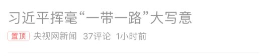
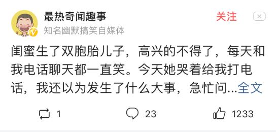

# API-Design

## News

### /news/list/_category/start=_num&count=_num

返回 _category 页面由 _start 开始，共 _count 条新闻

#### Type - GET

#### Response

```json
{
  "message": "success",
  "data": [
    {
      "id": 0,
      "type": "news",
      "imgPos": "text",
      "title": "title",
      "author": "author",
      "comments": "10万",
      "time": "time"
    },
    {
      "id": 1,
      "type": "news",
      "imgPos": "multiple",
      "title": "title",
      "images": [
        "url", "url", "url"
      ],
      "author": "author",
      "comments": "10万",
      "time": "time"
    },
    {
      "id": 2,
      "type": "news",
      "imgPos": "single",
      "title": "title",
      "images": [
        "url", "url", "url"
      ],
      "author": "author",
      "comments": "10万",
      "time": "time"
    },
    {
      "id": 3,
      "type": "news",
      "imgPos": "right",
      "title": "title",
      "image": "url",
      "author": "author",
      "comments": "10万",
      "time": "time"
    },
    {
      "id": 4,
      "type": "live",
      "imgPos": "text",
      "author": [
        "name": "author",
        "avatar": "url"
      ],
      "content": "content",
      "share": 11,
      "comments": "10万",
      "star": "10万"
    },
    {
      "id": 5,
      "type": "live",
      "imgPos": "single",
      "author": [
        "name": "author",
        "avatar": "url"
      ],
      "content": "content",
      "image": "url",
      "share": 11,
      "comments": "10万",
      "star": "10万"
    },
    {
      "id": 6,
      "type": "live",
      "imgPos": "multiple",
      "author": {
        "name": "author",
        "avatar": "url"
      },
      "images": [
        "url", "url", "url"
      ],
      "comments": "10万",
      "time": "time"
    }
  ]
}
```

#### Request Sample

- Objective-c

  ```objc
  NSURLSessionConfiguration *config = [NSURLSessionConfiguration defaultSessionConfiguration];
  NSURLSession *session = [NSURLSession sessionWithConfiguration: config
                                                        delegate: (id)self
                                                   delegateQueue: nil];
  NSURL *url = [NSURL URLWithString:@"http://serverIP/api/news/list/society/start=0&count=10"];

  NSURLSessionDataTask *dataTask =
    [session dataTaskWithURL: url completionHandler: ^(NSData *data, NSURLResponse *response, NSError *err) {
      if (nil == err) {
        NSDictionary *dict = [NSJSONSerialization JSONObjectWithData: data
                                                             options: 0
                                                               error: nil];
        // code with dict data
      }
  }];
  [dataTask resume];
  ```

- javascript

  ```javascript
  axios.get('http://serverIP/api/news/list/society/start=0&num=10')
    .then((res) => {
      // code with res
    });
    .catch((err) => {
      // code with err
    });
  ```

#### Tips

数据对应样式

||Text|Single|Multiple|Right|
|:-:|:-:|:-:|:-:|:-:|:-:|:-:|:-:|
|News|||||
|Live||||-|

### /news/detail/_newsID

获取新闻详细信息

#### Type - GET

#### Response

```json
{
  "message": "success",
  "data": {
    "title": "title",
    "author": {
      "id": 0,
      "name": "author",
      "avatar": "url"
    },
    "time": "time",
    "content": "content",
    "star_read": "10万"
  }
}
```

#### Request Sample

- Objective-c

  ```objc
  NSURLSessionConfiguration *config = [NSURLSessionConfiguration defaultSessionConfiguration];
  NSURLSession *session = [NSURLSession sessionWithConfiguration: config
                                                        delegate: (id)self
                                                   delegateQueue: nil];
  NSURL *url = [NSURL URLWithString:@"http://serverIP/api/news/detail/10"];

  NSURLSessionDataTask *dataTask =
    [session dataTaskWithURL: url completionHandler: ^(NSData *data, NSURLResponse *response, NSError *err) {
      if (nil == err) {
        NSDictionary *dict = [NSJSONSerialization JSONObjectWithData: data
                                                             options: 0
                                                               error: nil];
        // code with dict data
      }
  }];
  [dataTask resume];
  ```

- javascript

  ```javascript
  axios.get('http://serverIP/api/news/detail/10')
    .then((res) => {
      // code with res
    });
    .catch((err) => {
      // code with err
    });
  ```

## Comments

### /comment/list/_newsID/start=_num&count=_num

获取新闻中由 _start 开始，共 _count 条评论

#### Type - GET

#### Response

```json
{
  "message": "success",
  "data": [
    {
      "id": 0,
      "user": {
        "id": 0,
        "avatar": "url",
        "name": "name"
      },
      "content": "content",
      "star": "10万",
      "reply": {
        "count": "10万",
        "list": []
      },
      "time": "time",
      "star": "10万"
    }, {
      "id": 1,
      "user": {
        "id": 1,
        "avatar": "url",
        "name": "name"
      },
      "content": "content",
      "star": "10万",
      "reply": {
        "count": "10万",
        "list": [{
          "id": 2,
          "user": {
            "id": 2,
            "avatar": "url",
            "name": "name"
          },
          "content": "content",
          "star": "10万"
        }, {
          "id": 2,
          "user": {
            "id": 2,
            "avatar": "url",
            "name": "name"
          },
          "content": "content",
          "star": "10万"
        }]
      },
      "time": "time",
      "star": "10万"
  }]
}
```

#### Request Sample

- Objective-c

  ```objc
  NSURLSessionConfiguration *config = [NSURLSessionConfiguration defaultSessionConfiguration];
  NSURLSession *session = [NSURLSession sessionWithConfiguration: config
                                                        delegate: (id)self
                                                   delegateQueue: nil];
  NSURL *url = [NSURL URLWithString:@"http://serverIP/api/comment/list/start=0&num=10"];

  NSURLSessionDataTask *dataTask =
    [session dataTaskWithURL: url completionHandler: ^(NSData *data, NSURLResponse *response, NSError *err) {
      if (nil == err) {
        NSDictionary *dict = [NSJSONSerialization JSONObjectWithData: data
                                                             options: 0
                                                               error: nil];
        // code with dict data
      }
  }];
  [dataTask resume];
  ```

- javascript

  ```javascript
  axios.get('http://serverIP/api/comment/list/start=0&num=10')
    .then((res) => {
      // code with res
    });
    .catch((err) => {
      // code with err
    });
  ```

### /comment/publication

#### Type - Post

- Data

  ```json
  {
    "newsID": 2,
    "userID": 2,
    "text": "text"
  }
  ```

#### Response

- success

  ```json
  {
    "message": "success"
  }
  ```

- fail

  ```json
  {
    "message": "err msg"
  }
  ```

#### Request Sample

- Objective-c

  ```objc
  NSURLSessionConfiguration *config = [NSURLSessionConfiguration defaultSessionConfiguration];
  NSURLSession *session = [NSURLSession sessionWithConfiguration: config
                                                        delegate: nil
                                                   delegateQueue: nil];
    NSURL *url = [NSURL URLWithString:@"http://serverIP/comment/publish"];
    NSMutableURLRequest *request = [NSMutableURLRequest requestWithURL:url];
    [request setHTTPMethod:@"POST"];
    NSString *params = @"userID=2&newsID=2&text=text";
    [request setHTTPBody:[params dataUsingEncoding:NSUTF8StringEncoding]];

    NSURLSessionDataTask *dataTask =
      [session dataTaskWithRequest: request completionHandler: ^(NSData *data, NSURLResponse *res, NSError *err) {
        if (nil == err) {
          NSDictionary *dict = [NSJSONSerialization JSONObjectWithData: data
                                                               options: 0
                                                                 error: nil];
          // code with dict data
        }
    }];

    [dataTask resume];
  ```

- javascript

  ```javascript
  axios.post('http://serverIP/comment/publish', {
    userID: 2,
    newsID: 2,
    text: "text"
  })
    .then((res) => {
      // code with res
    });
    .catch((err) => {
      // code with err
    });
  ```

## User

### /user/login

#### Type - Post

- Data

  ```json
  {
    "username": "username",
    "password": "password"
  }
  ```

#### Response

- success

  ```json
  {
    "message": "success"
  }
  ```

- fail

  ```json
  {
    "message": "err msg"
  }
  ```

#### Request Sample

- Objective-c

  ```objc
  NSURLSessionConfiguration *config = [NSURLSessionConfiguration defaultSessionConfiguration];
  NSURLSession *session = [NSURLSession sessionWithConfiguration: config
                                                        delegate: nil
                                                   delegateQueue: nil];
    NSURL *url = [NSURL URLWithString:@"http://serverIP/user/login"];
    NSMutableURLRequest *request = [NSMutableURLRequest requestWithURL:url];
    [request setHTTPMethod:@"POST"];
    NSString *params = @"username=test&password=test";
    [request setHTTPBody:[params dataUsingEncoding:NSUTF8StringEncoding]];

    NSURLSessionDataTask *dataTask =
      [session dataTaskWithRequest: request completionHandler: ^(NSData *data, NSURLResponse *res, NSError *err) {
        if (nil == err) {
          NSDictionary *dict = [NSJSONSerialization JSONObjectWithData: data
                                                               options: 0
                                                                 error: nil];
          // code with dict data
        }
    }];

    [dataTask resume];
  ```

- javascript

  ```javascript
  axios.post('http://serverIP/user/login', {
    username: "test",
    password: "test"
  })
    .then((res) => {
      // code with res
    });
    .catch((err) => {
      // code with err
    });
  ```

### /user/signup

#### Type - Post

- Data

  ```json
  {
    "username": "username",
    "password": "password"
  }
  ```

#### Response

- success

  ```json
  {
    "message": "success"
  }
  ```

- fail

  ```json
  {
    "message": "err msg"
  }
  ```

#### Request Sample

- Objective-c

  ```objc
  NSURLSessionConfiguration *config = [NSURLSessionConfiguration defaultSessionConfiguration];
  NSURLSession *session = [NSURLSession sessionWithConfiguration: config
                                                        delegate: nil
                                                   delegateQueue: nil];
    NSURL *url = [NSURL URLWithString:@"http://serverIP/user/signup"];
    NSMutableURLRequest *request = [NSMutableURLRequest requestWithURL:url];
    [request setHTTPMethod:@"POST"];
    NSString *params = @"username=test&password=test";
    [request setHTTPBody:[params dataUsingEncoding:NSUTF8StringEncoding]];

    NSURLSessionDataTask *dataTask =
      [session dataTaskWithRequest: request completionHandler: ^(NSData *data, NSURLResponse *res, NSError *err) {
        if (nil == err) {
          NSDictionary *dict = [NSJSONSerialization JSONObjectWithData: data
                                                               options: 0
                                                                 error: nil];
          // code with dict data
        }
    }];

    [dataTask resume];
  ```

- javascript

  ```javascript
  axios.get('http://serverIP/user/signup', {
    username: "test",
    password: "test"
  })
    .then((res) => {
      // code with res
    });
    .catch((err) => {
      // code with err
    });
  ```

### /user/info/_userID

获取用户信息

#### Type - GET

#### Response

```json
{
  "message": "success",
  "data": {
    "id": 1,
    "avatar": "url",
    "name": "name"
  }
}
```

#### Request Sample

- Objective-c

  ```objc
  NSURLSessionConfiguration *config = [NSURLSessionConfiguration defaultSessionConfiguration];
  NSURLSession *session = [NSURLSession sessionWithConfiguration: config
                                                        delegate: (id)self
                                                   delegateQueue: nil];
  NSURL *url = [NSURL URLWithString:@"http://serverIP/api/user/info/0"];

  NSURLSessionDataTask *dataTask =
    [session dataTaskWithURL: url completionHandler: ^(NSData *data, NSURLResponse *response, NSError *err) {
      if (nil == err) {
        NSDictionary *dict = [NSJSONSerialization JSONObjectWithData: data
                                                             options: 0
                                                               error: nil];
        // code with dict data
      }
  }];
  [dataTask resume];
  ```

- javascript

  ```javascript
  axios.get('http://serverIP/api/user/info/0')
    .then((res) => {
      // code with res
    });
    .catch((err) => {
      // code with err
    });
  ```
